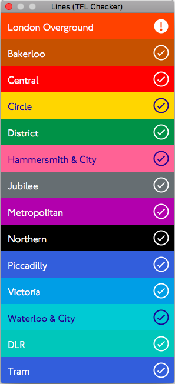

# Lines

A simple clone of the Lines tube status app written in the Red Programming Language.



# Installation

You need to install the Red programming language first before building this program

Download Red below:

[Red Windows/Mac/Linux](http://www.red-lang.org/p/download.html)

or via Homebrew:

```
brew cask install red
```

Once you have Red installed on your system clone this repo and head to the building section.

# Building

Clone this repo and run:

```
red -c -r Lines.red
```

Tested on macOS with Red 0.6.3 stable.

Note this command should work on Windows and Mac. However, since GUI support is not available on Linux, This clone of lines is not supported for now.

# License

MIT

